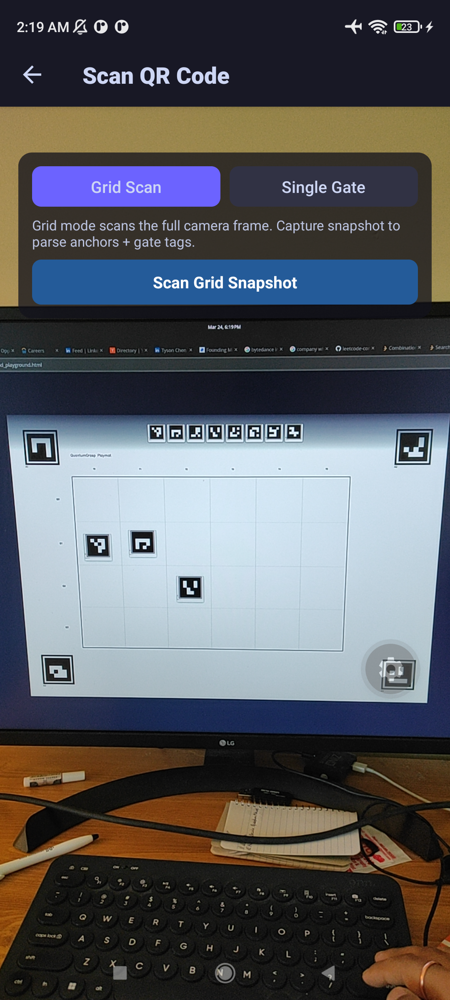
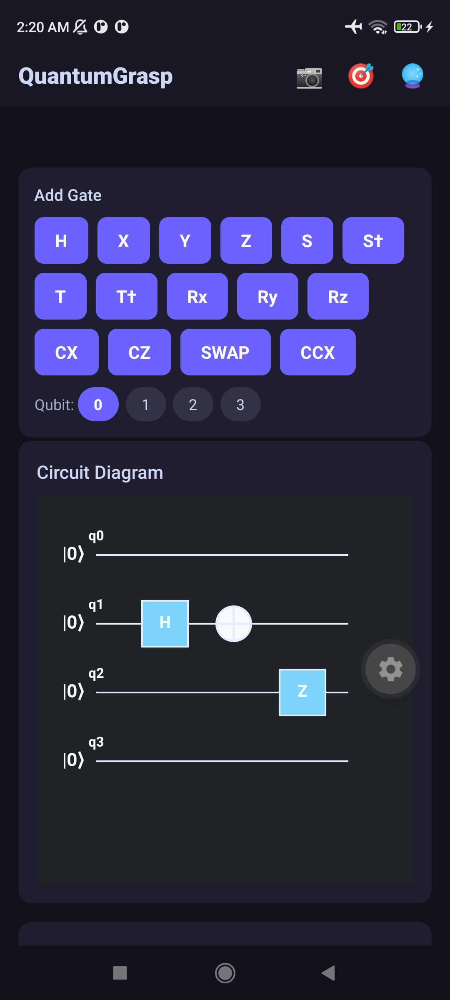
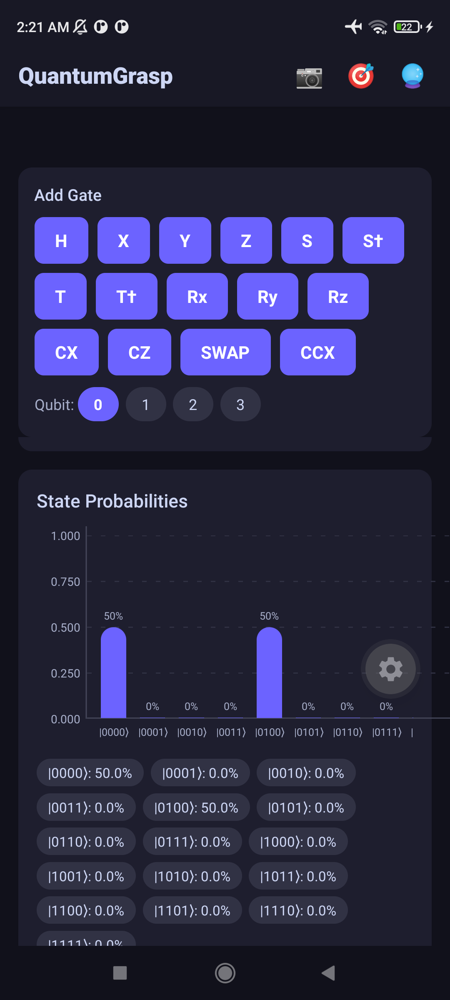
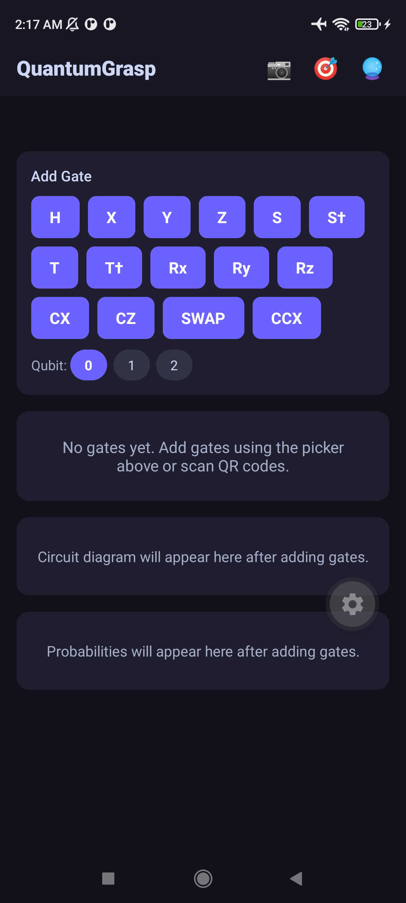

# QuantumGrasp

**Work in progress** — developed at the **Kennesaw State University (KSU) Quantum Security Lab**.

QuantumGrasp is a mobile app for **quantum computing education**. Students build circuits from physical playmats or on-screen controls, run **on-device** simulation, and see probabilities and circuit diagrams update in real time. The longer-term vision is a **tactile, AR-forward** experience (markers, 3D Bloch visualization, spatial measurement); the current build focuses on the **learn → simulate → visualize** loop on React Native / Expo.

---

## Eventual goals

The app is meant to **make quantum computing accesible** for learners by making the pipeline **immediate and physical**:

| Direction | Aim |
|-----------|-----|
| **Tangible input** | Map a **paper or printed playmat** (grid + gate symbols) to a digital circuit via the camera—so “what you place” becomes “what the simulator runs,” with a manual gate picker as fallback. |
| **Instant feedback** | **Local** simulation (no cloud required for core flows) so gate changes feel live; support on the order of **3–5 qubits** for teaching. |
| **Clear visualization** | Probability distributions, readable circuit diagrams, and (target) **3D / AR** views (e.g. Bloch sphere) so superposition and measurement are intuitive. |
| **Spatial measurement** | Use **device orientation** (and eventually AR) so “measuring” feels like a deliberate physical act, with student-friendly explanations of collapse and basis. |


---

## Screenshots (current build)

<p align="center">
  
  <br />
  <em>Grid scan mode — camera with playmat alignment and gate detection.</em>
</p>

<p align="center">
  
  &nbsp;
  
  <br />
  <em>Left: circuit after scan / edit. Right: measurement probabilities.</em>
</p>

<p align="center">
  
  <br />
  <em>Printed playmat / blank template used with the scanner.</em>
</p>

---

## Features (today)

- **Manual circuit editing** — Gate palette (H, Pauli, S/T and adjoints, rotations, CX, CZ, SWAP, CCX), qubit selection, list of placed gates.
- **Grid / playmat scanning** — Full-grid scan path that maps detected gates and layout into the circuit model (with native grid detection where enabled).
- **Local simulation** — [`jsqubits`](https://github.com/davidbkemp/jsqubits)-based engine; probabilities refresh as the circuit changes.
- **Visualization** — Bar chart of outcome probabilities; **[@microsoft/quantum-viz.js](https://github.com/microsoft/quantum-viz.js)** WebView for the circuit diagram.
- **Measurement screen** — Orientation-driven measurement UX (see app navigation).
- **AR / Bloch (Barely working for now, will be implemented later)** — Staged or placeholder paths; AR stack may use ViroReact + dev client (see below).

Student-facing exercises live in **`docs/student-exercises.md`**.

---

## Setup

### Prerequisites

- **Node.js 20+**
- **Expo** (`npx expo`)
- Physical device: **Expo Go** for quick tests, or **dev client** for native modules (camera, AR).

### Install and run

```bash
npm install
npx expo start
```

Scan the QR code with Expo Go, or press `a` / `i` for Android / iOS.

### Printable markers / playmats

If your repo includes shared scripts from a sibling project, you can generate QR markers with `../scripts/generate_qr_markers.html` (same idea as the original Flutter workflow). Grid playmat assets are documented alongside lab materials as needed.

---

## Project structure (high level)

```
src/
├── models/          # Gate, circuit types
├── services/        # Simulation, circuit store, grid scan, quantum-viz HTML
├── components/      # UI: gate picker, charts, WebView diagram, etc.
├── screens/         # Circuit, scanner, measurement, AR, etc.
└── navigation/      # React Navigation stack
```

---

## Dependencies (selected)

| Area | Package |
|------|---------|
| Simulation | `jsqubits` |
| Circuit diagram | `@microsoft/quantum-viz.js` |
| Camera | `expo-camera` |
| Charts | `react-native-gifted-charts` (and related) |
| State | `zustand` |
| Navigation | `@react-navigation/native-stack` |
| AR (optional) | `@reactvision/react-viro`, `expo-dev-client` |

---

## Enabling AR (developers)

The AR experience may still be a placeholder depending on branch. A typical path:

1. Ensure ViroReact / native AR dependencies are installed and compatible with your Expo SDK.
2. `npx expo prebuild` to generate native projects.
3. Wire `ARViewScreen` (or equivalent) to `ViroARSceneNavigator` and test on a physical AR-capable device.

*QuantumGrasp — KSU Quantum Security Lab (WIP).*
