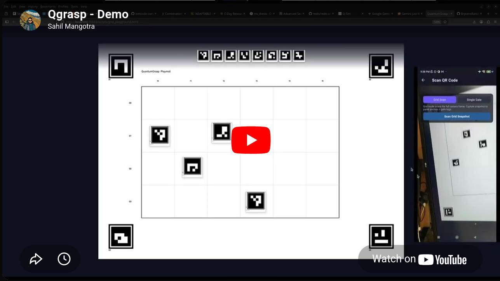
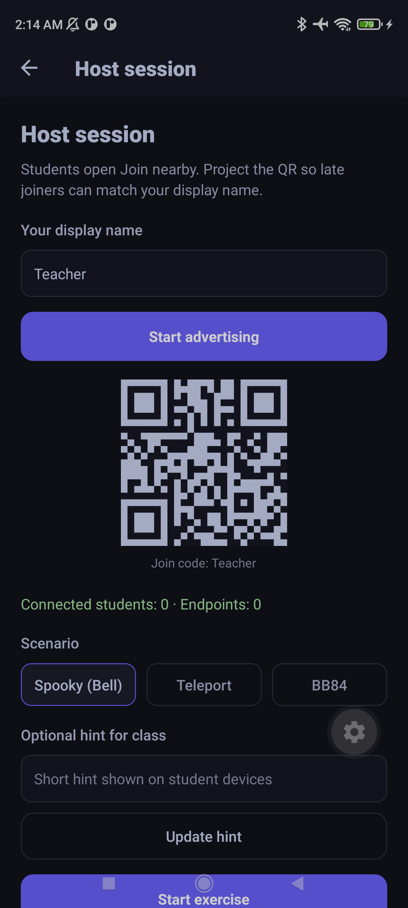

# QuantumGrasp

**Work in progress** — developed at the **Kennesaw State University (KSU) Quantum Security Lab**.

QuantumGrasp is a mobile app for **quantum computing education**. Students build circuits from physical playmats or on-screen controls, run **on-device** simulation, and see probabilities and circuit diagrams update in real time. The longer-term vision is a **tactile, AR-forward** experience (markers, 3D Bloch visualization, spatial measurement); the current build focuses on the **learn → simulate → visualize** loop on React Native / Expo.

---

## Eventual goals

The app is meant to **make quantum computing accesible** for learners by making the pipeline **immediate and physical**:

| Direction | Aim |
|-----------|-----|
| **Tangible input** | Map a **paper or printed playmat** (grid + gate symbols) to a digital circuit via the camera—so “what you place” becomes “what the simulator runs,” with a manual gate picker as fallback. |
| **Instant feedback** | **Local** simulation (no cloud required for core flows) so gate changes feel live; support on the order of **3–5 qubits** for teaching. |
| **Clear visualization** | Probability distributions, readable circuit diagrams, and (target) **3D / AR** views (e.g. Bloch sphere) so superposition and measurement are intuitive. |
| **Spatial measurement** | Use **device orientation** (and eventually AR) so “measuring” feels like a deliberate physical act, with student-friendly explanations of collapse and basis. |


---

## Screenshots (current build)

<p align="center">
  
  <br />
  <em>Grid scan mode — camera with playmat alignment and gate detection.</em>
</p>

<p align="center">
  
  &nbsp;
  
  <br />
  <em>Left: circuit after scan / edit. Right: measurement probabilities.</em>
</p>

<p align="center">
  
  <br />
  <em>Printed playmat / blank template used with the scanner.</em>
</p>

<p align="center">
  <a href="https://youtu.be/2SAwh7PJTsc" target="_blank"></a>
  <br />
  <em>Circut Playment Scanner Demo Video</em>
</p>


<p align="center">
  
  <br />
  <em>Multiplayer classroom activity screenshot</em>
</p>
---

## Features (today)

- **Manual circuit editing** — Gate palette (H, Pauli, S/T and adjoints, rotations, CX, CZ, SWAP, CCX), qubit selection, list of placed gates.
- **Grid / playmat scanning** — Full-grid scan path that maps detected gates and layout into the circuit model (with native grid detection where enabled).
- **Local simulation** — [`jsqubits`](https://github.com/davidbkemp/jsqubits)-based engine; probabilities refresh as the circuit changes.
- **Visualization** — Bar chart of outcome probabilities; **[@microsoft/quantum-viz.js](https://github.com/microsoft/quantum-viz.js)** WebView for the circuit diagram.
- **Measurement screen** — Orientation-driven measurement UX (see app navigation).
- **[Multiplayer (classroom)](./docs/multiplayer-scenarios.md)** — **Host / join nearby** sessions over **Bluetooth and Wi‑Fi** (no accounts). A teacher advertises a session; students discover and connect. The host picks one of three **quantum teaching scenarios** — **Spooky (Bell)**, **Teleport**, or **BB84** — assigns **Alice / Bob / Eve**-style roles, and drives a shared exercise while clients sync through a **host-authoritative** room state. The host can show a **QR code** so joiners match the teacher’s display name; students can **scan the QR** or pick the host from a discovered-device list. Open it from the main circuit screen (**header → people**). Requires the **development build** and the **`QuantumNearby` native module** (see below); not available on web.
- **AR / Bloch (ViroReact)** — On a **physical device**, the AR screen loads **ViroReact** when the native module is available and shows the 3D Bloch / AR scene. On **web**, **iOS Simulator**, **Android Emulator**, or if the native module fails to load, the app **does not** `require` Viro; it shows a **fallback screen** instead so you can still navigate and test the rest of the app (circuits, charts, measurement, etc.) without the AR stack. Detection uses **`expo-device`** (`Device.isDevice` is false on simulators/emulators).

Student-facing exercises live in **`docs/student-exercises.md`**. Multiplayer **educational games** (what each scenario teaches) is in **`docs/multiplayer-scenarios.md`**.

---

## Setup

### Prerequisites

- **Node.js 20+**
- **Expo** (`npx expo`)
- Physical device: **Expo Go** for quick tests, or **dev client** for native modules (camera, AR).

### Install and run

```bash
npm install
npx expo start
```

Scan the QR code with Expo Go, or press `a` / `i` for Android / iOS.

**Android Viro vs no-Viro:** The default **`debug`** / **`release`** builds link **Viro** and ARCore-related native libraries. A separate **`noviro`** build type omits that stack (for **x86/x86_64 emulators** or when you skip AR). Plain `npx expo run:android` uses the normal **`debug`** variant (`installDebug`)—no `--variant` required. For no-Viro:

- `npm run android:noviro` — `expo run:android --variant noviro` (`installNoviro`)
- `npm run android:no-bundler:noviro` — Metro separate, no-Viro install

`npm run android:no-bundle` is an alias for `android:no-bundler` (common typo).

If the **Gradle build succeeds** but **`adb install` fails** (Expo exits after “Installing …apk”), the APK is still under `android/app/build/outputs/apk/`. Check the device: USB debugging, enough storage, uninstall a conflicting build, or signature mismatch (e.g. reinstall after changing signing). Run `adb install -r path/to.apk` in a terminal to see the full **Failure** line from `adb`.

### Printable markers / playmats

If your repo includes shared scripts from a sibling project, you can generate QR markers with `../scripts/generate_qr_markers.html` (same idea as the original Flutter workflow). Grid playmat assets are documented alongside lab materials as needed.

---

## Project structure (high level)

```
src/
├── models/              # Gate, circuit types
├── services/            # Simulation, circuit store, grid scan, quantum-viz HTML
│   └── multiplayer/     # Nearby transport, session store, wire protocol, helpers
├── components/          # Gate picker, charts, WebView diagram, etc.
├── screens/             # Circuit, scanner, measurement, AR, etc.
│   └── multiplayer/     # Multiplayer home, host lobby, join nearby, scenario UI
└── navigation/          # React Navigation stack
```

---

## Dependencies (selected)

| Area | Package |
|------|---------|
| Simulation | `jsqubits` |
| Circuit diagram | `@microsoft/quantum-viz.js` |
| Camera | `expo-camera` |
| Charts | `react-native-gifted-charts` (and related) |
| State | `zustand` |
| Navigation | `@react-navigation/native-stack` |
| Multiplayer (UI) | `react-native-qrcode-svg`, `expo-camera` (QR scan for join) |
| Multiplayer (transport) | Native **`QuantumNearby`** module (advertising, discovery, payloads); see `src/services/multiplayer/nearbyTransport.ts` |
| AR (optional) | `@reactvision/react-viro`, `expo-dev-client` |
| Device vs simulator | `expo-device` (used to skip loading Viro on emulators/simulators) |

---

## Multiplayer (developers)

- **Stack:** React state lives in **`multiplayerSessionStore`** (Zustand). Messages are JSON over a small **base64 wire format** (`src/services/multiplayer/wire.ts`). Native events are wired once at the root via **`useNearbyListeners`** in `AppNavigator`.
- **Platforms:** Multiplayer is implemented for **native apps** that include **`NativeModules.QuantumNearby`**. If that module is missing (e.g. Expo Go only, or a build without the native code), screens show an alert with reinstall / dev-client guidance.
- **Android:** Nearby-style flows may request runtime permissions through **`nearbyAndroidPermissions`** (host vs peer). Build with **`npx expo run:android`** (or your usual dev client) after `prebuild` so the native project matches this repo.
- **Flow:** `MultiplayerHome` → **Host** (`HostLobby`: advertise, scenario A/B/C, optional class hint, QR for display name) or **Join** (`JoinNearby`: discovery list + optional QR scan) → **`MultiplayerScenario`** when the host starts the exercise.
- **Teaching notes:** See **`docs/multiplayer-scenarios.md`** for Bell / teleport / BB84 explanations and how the app simplifies each for the classroom.

---

## Enabling AR (developers)

**Where AR runs:** Full Viro / AR requires a **development build** on a **physical phone or tablet** with AR support. **Emulators and simulators** are intentionally **not** treated as AR targets: `ARViewScreen` only attempts to load Viro when `Platform.OS !== 'web'` and `Device.isDevice === true` (see `src/screens/ARViewScreen.tsx`). That keeps emulator workflows stable for testing non-AR features.

**Typical setup:**

1. **Align Expo packages** — Use the same SDK line for `expo`, `expo-constants`, and other Expo modules (e.g. SDK 55 together). A mismatched `expo-constants` version can break Android native builds.
2. Ensure ViroReact and native AR dependencies match your Expo SDK; Viro’s config may expect **New Architecture** (`newArchEnabled` on Android, `RCT_NEW_ARCH_ENABLED` on iOS).
3. `npx expo prebuild` from the **project root** (where `package.json` lives) to generate native projects.
4. Build and install the dev client, then open the AR screen on a **real device** to test Viro.

*QuantumGrasp — KSU Quantum Security Lab (WIP).*
